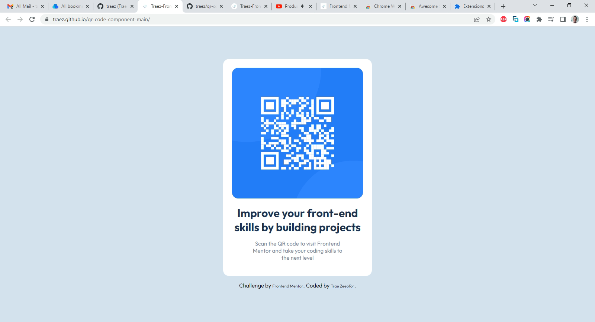

# Frontend Mentor - QR code component solution

This is a solution to the [QR code component challenge on Frontend Mentor](https://www.frontendmentor.io/challenges/qr-code-component-iux_sIO_H). Frontend Mentor challenges help you improve your coding skills by building realistic projects. 

## Table of contents

- [Overview](#overview)
  - [Screenshot](#screenshot)
  - [Links](#links)
- [My process](#my-process)
  - [Built with](#built-with)
  - [What I learned](#what-i-learned)
  - [Continued development](#continued-development)
  - [Useful resources](#useful-resources)
- [Author](#author)
- [Acknowledgments](#acknowledgments)

## Overview

### Screenshot

### Links

- Solution URL: [https://github.com/traez/qr-code-component-main](https://github.com/traez/qr-code-component-main)
- Live Site URL: [https://traez.github.io/qr-code-component-main/](https://traez.github.io/qr-code-component-main/)

## My process
Conceptualized HTML first, then tackled CSS.

### Built with

- Semantic HTML5 markup
- CSS custom properties
- Flexbox
- Mobile workflow considered

### What I learned

This was my very first project on frontendmentor so there was much to learn. The cloning methodology basically. 
I strongly believe I can only get better.

### Continued development

Getting better at Project building and Port-folio strengthening.

### Useful resources

Please see Acknowledgement section.

## Author

- Website - [Trae Zeeofor](https://github.com/traez)
- Frontend Mentor - [@traez](https://www.frontendmentor.io/profile/traez)
- Twitter - [@trae_z](https://twitter.com/trae_z)

## Acknowledgments

1 Solomon Ekrebe, for introducing me to frontendmentor.io  
2 Tech content creators on YouTube; my teachers :-)  
3 SlackOverFlow community; for debugging me  
4 w3schools.com, MDN and Google Search Teachers  
5 Novare Central for work station provision.  
